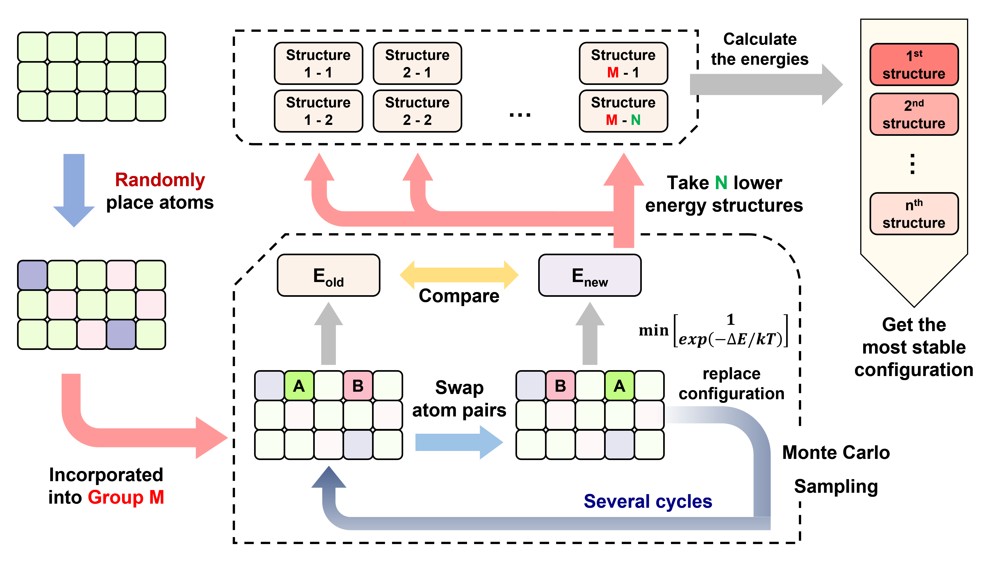

# CHGNet-based-MC-sampling-toolkit
Post-processing script for CHGNet

The CHGNet model comes from this study:

Deng, B., Zhong, P., Jun, K. et al. CHGNet as a pretrained universal neural network potential for charge-informed atomistic modelling. Nat Mach Intell 5, 1031–1041 (2023). 

https://doi.org/10.1038/s42256-023-00716-3

# Outline
- [Perform calculations](#Executable-file-cnsub_runpy)
- [Capture DFT data](#Executable-file-cnsub_greppy)
- [Fine-tuning](#Executable-file-cnsub_trainpy)

 
 

## Executable file: cnsub_run.py
### ▸ Input files:
**Input_CHGNet** : Required. If this file is not present, the program will generate a template and then terminate execution.

**POSCAR** : Required. Must conform to the standard VASP input format.

**Fine_Tune_Model.tar** : Optional. Provides parameter configurations during execution. If absent, the program defaults to the parameters of CHGNet v0.3.0.

### ▸ Output main files:
**CHGNet_results.log** : Output log of program execution.

**Output_details** : System details such as forces and tensions are output during program execution.

**Trajectory_VASP** : Trajectory files of atomic positions during relaxation are written in VASP format.

### ▸ Function

**☑ Single point calculation**
> IBRION: -1

> Energy, force, stress, and magnetic moment predictions are performed using CHGNet.

**☐ X-ray diffractometer (XRD)**
> Automatically given in the calculation.

**☑ Molecular dynamics**
> IBRION: 0

> Run a molecular dynamics simulation. You can choose to simulate in the NVE, NVT, or NPT ensemble.                 
> Note! The choice of thermostat affects the lattice degrees of freedom during the NPT simulation.

**☑ Geometry optimization**
> IBRION: 1 or 3

> Use different algorithms to optimize the structure and find the local minimum on the potential energy surface.
> The lattice degrees of freedom can be selected during the optimization process.
> It is recommended to use 1 when initially stabilizing the structure; use 3 when the initial structure differs greatly from the target.

<!-- **☐ Phonon calculation** -->
<!-- > IBRION: 5 -->

<!-- > Use finite differences to compute the hessian matrix and solve for the eigenvectors and eigenvalues. -->
<!-- > And it comes with thermodynamic correction for the specified temperature. -->

**☑ Sampling optimization using Monte Carlo**
> IBRION: 11 or 13

> The user can provide an initial structural model (POSCAR) and specify the atomic indices (starting from 0), as well as the types and numbers of dopant atoms in the "Input_CHGNet".
> The program sequentially introduces dopants according to the given order and employs a Monte Carlo exchange algorithm, where atomic swaps are either accepted or rejected based on their associated energies.
> This process continues until the convergence criterion is satisfied or the maximum number of steps is reached.

> The optimization algorithm is the same as that in the optimization section.
> The program allows you to set two convergence conditions to more strictly optimize the selected structures after the 1st stage of screening.

 

**☐ Mechanical properties**
> IBRION: 71 or 73

> Calculates the elasticity tensor and solves for mechanical properties such as Young's modulus and bulk modulus.
> It also outputs acoustic properties.
> The optimization algorithm is the same as that in the optimization section.

**☐ Nudged Elastic Band (NEB)**
> IBRION: 80 or 83

> Solve the transition state problem using known initial and final structures and a series of related images.
> The number of images required is high and it is suitable for paths with multiple transition states.
> Use the steepest descent (SD) (80) or the fast inertial relaxation engine (FIRE) (83) algorithm.

**☐ Climbing-Image Nudged Elastic Band (CI-NEB)**
> IBRION: 90 or 93

> Similar to NEB, except that the energy peak continues to climb.
> If convergence is achieved, the system automatically performs phonon calculations for the transition state.
> It requires fewer images and is recommended for single transition state paths.
> Use the steepest descent (SD) (90) or the fast inertial relaxation engine (FIRE) (93) algorithm.

 
 

## Executable file: cnsub_grep.py
### ▸ Input files (from VASP)
Just follow user interaction instructions.

### ▸ Output files
**dataset_*.json** : Training data captured by the program.

 
 

## Executable file: cnsub_train.py
### ▸ Input files (from cnsub_grep.py)
**Input_CHGNet_Training** : Required. Training process settings. If this file is not present, the program will generate a template and then terminate execution.

**dataset_*.json** : Required. Training data set captured by cnsub_grep.py.

**Fine_Tune_Model.tar** : Optional. Provides parameter configurations during execution. If absent, the program defaults to the parameters of CHGNet v0.3.0.

### ▸ Output main files
**epochX_eX_fX_sX_mX.pth.tar** or 

**bestE_epochX_eX_fX_sX_mX.pth.tar** or

**bestF_epochX_eX_fX_sX_mX.pth.tar** : New model trained by the program.

**_CHGNet_X.png** : The loss function of the training set and the validation set output by the training process. With each epoch training output.

**__CHGNet_X.png** : Scatter plot of the test set, only output after training is completed.
